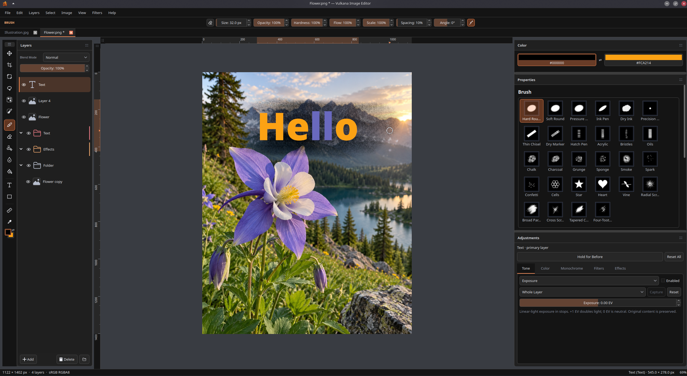

# Vulkana Image Editor

A Linux-first image editor for painting, retouching and layered composition,
with a Qt workspace and Vulkan-accelerated canvas.



## Features

- **Layered editing:** raster, editable text and shapes; folders, multi-selection,
  blend modes, duplication, merging and explicit rasterization.
- **Painting and retouching:** pressure-sensitive brushes, procedural and textured
  presets, erasing, fill, local blur, Clone Stamp, Heal and automatic Spot Heal.
- **Selections:** rectangle, ellipse, freehand/polygon/magnetic lasso, select by
  color and smart selection, with grow/shrink, inversion and reselect.
- **Transforms:** move, scale, rotate, flip and corner distortion; transform
  selection boundaries or selected pixels, with snapping and alignment guides.
- **Non-destructive adjustments:** exposure, levels, curves, hue/saturation,
  vibrance, color balance, warmth/tint, monochrome conversion and inversion.
- **Filters and layer effects:** Gaussian, Motion and Lens Blur; Stroke, Drop/Inner
  Shadow, Outer/Inner Glow, Color Overlay and Gradient Overlay.
- **Multiple documents:** tabs with independent history, selections and view state,
  plus editable layer copying between documents.
- **PDF import:** selected pages at your chosen PPI, as raster layers or separate
  documents, with transparent or white backgrounds.
- **Workspace and output:** dockable panels, themes, editable shortcuts, rulers,
  Pixel Preview, native `.vulkana` projects and PNG/JPEG/WebP export.

Actively developed beta. Please keep backups of important projects.

## Build and run

Requires Linux, a C++20 compiler, Ninja, pkg-config, and these development libraries:

- CMake **3.28+** for the supplied presets.
- Qt **6.8+**: Core, Gui, Widgets, Network and PDF; Qt Test for tests.
- qpdf **11+** development library (page geometry; not the command-line tool).
- Vulkan **1.2+** headers/loader, a working Vulkan driver, and `glslc`.
- minizip-ng **4.x** (the `minizip` pkg-config module, not legacy minizip).
- libwebp and libwebpmux **1.2+**.

Install Qt's platform plugins for your desktop, SVG support and image-format
plugins. Point `CMAKE_PREFIX_PATH` at your Qt installation if it is outside the
system search path.
Qt PDF is a separate development package on many distributions (for example,
`qt6-qtpdf-devel` on Fedora, `qt6-pdf-dev` on Ubuntu). It does not require a
WebEngine browser in Vulkana's runtime.

From the repository root:

```sh
cmake --preset release -DIMAGEEDITOR_BUILD_TESTS=OFF
cmake --build --preset release --parallel
./build/release/src/app/imageeditor
```

Projects and images can also be passed as arguments:

```sh
./build/release/src/app/imageeditor "project.vulkana" "photo.webp"
```

Qt selects Wayland or X11 from the session. Preferences and custom presets live
in per-user storage. Online services are optional; without
[service configuration](config/SERVICES.md), updates and feedback stay disabled.

For development and tests:

```sh
cmake --preset debug
cmake --build --preset debug --parallel
ctest --preset debug
```

Debug/native rendering checks need Vulkan validation layers. Some interaction
tests require a running Wayland/X11 desktop.

## Architecture

- `src/core` — platform-neutral documents, layers, geometry, image algorithms
  and undoable transactions.
- `src/render` — shared Vulkan canvas, composition, overlays and bounded GPU caches.
- `src/ui` — Qt panels, tools, document tabs, text/shape preparation and file I/O.
- `src/platform` — resource lookup, desktop integration and optional services.
- `src/app` — application entry point; `shaders` — Vulkan shader sources.

Each document owns its content and history; tabs share one workspace and Vulkan
renderer. Editable source data stays separate from render caches. Canvas,
Pixel Preview and export share the same composition rules.

See the [developer docs](docs/README.md) and [architecture guide](docs/ARCHITECTURE.md).

## License

Vulkana-owned code, documentation and assets are [MIT licensed](LICENSE).
Third-party material retains its own licenses; see [third-party notices](THIRD_PARTY.md).
